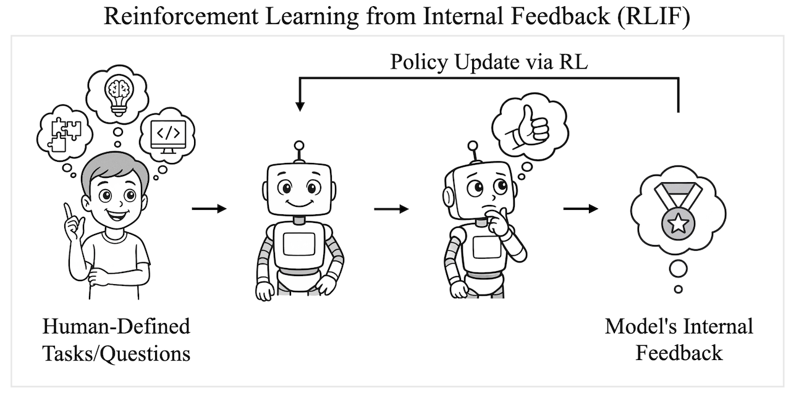
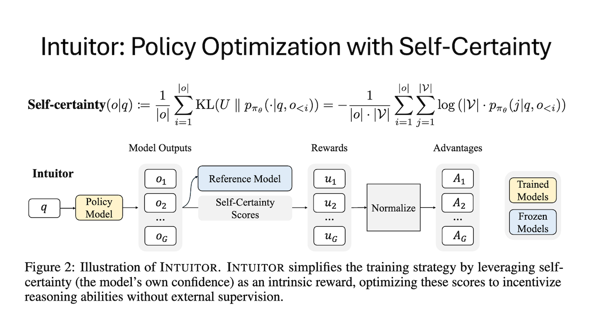
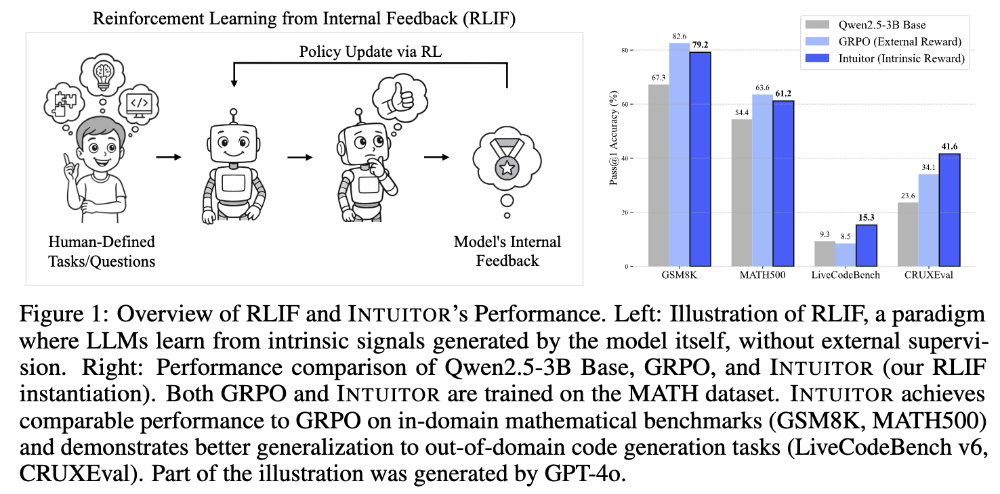

# Learning to Reason without External Rewards

[](https://arxiv.org/abs/2505.19590)
[](https://huggingface.co/collections/sunblaze-ucb/intuitor-684f895c78ed2d3ef3a678b3)

**Intuitor** is a reinforcement learning method that fine-tunes large language models (LLMs) using *self-certainty*—the model’s own internal confidence—as the sole reward. It is built on a novel paradigm we call **Reinforcement Learning from Internal Feedback (RLIF)**.



### 🧭 What is RLIF?

**Reinforcement Learning from Internal Feedback (RLIF)** is a training framework where language models learn *without any external rewards, gold labels, or verifiers*. Instead, models improve by optimizing *intrinsic signals*—such as confidence in their own answers—generated entirely from within. RLIF enables scalable and domain-agnostic fine-tuning of LLMs in settings where human feedback or verifiable supervision is expensive or unavailable.

Intuitor instantiates RLIF by using **self-certainty**—a model's confidence measured via KL divergence to uniform—as an intrinsic reward in the GRPO policy optimization algorithm.



## 🚀 Update [2025-06-16]

We have released four model checkpoints trained on the MATH dataset for one epoch. You're welcome to try out the models and evaluate their performance!

[View Model Collections](https://huggingface.co/collections/sunblaze-ucb/intuitor-684f895c78ed2d3ef3a678b3)

| Model Name | Size | Method | Hugging Face Link |
|------------|------|--------|--------------------|
| `sunblaze-ucb/Qwen2.5-1.5B-Intuitor-MATH-1EPOCH` | 1.5B | Intuitor | [View Model](https://huggingface.co/sunblaze-ucb/Qwen2.5-1.5B-Intuitor-MATH-1EPOCH) |
| `sunblaze-ucb/Qwen2.5-3B-Intuitor-MATH-1EPOCH` | 3B   | Intuitor | [View Model](https://huggingface.co/sunblaze-ucb/Qwen2.5-3B-Intuitor-MATH-1EPOCH) |
| `sunblaze-ucb/OLMo-2-7B-SFT-Intuitor-MATH-1EPOCH` | 7B   | Intuitor | [View Model](https://huggingface.co/sunblaze-ucb/OLMo-2-7B-SFT-Intuitor-MATH-1EPOCH) |
| `sunblaze-ucb/Qwen3-14B-Intuitor-MATH-1EPOCH` | 14B  | Intuitor | [View Model](https://huggingface.co/sunblaze-ucb/Qwen3-14B-Intuitor-MATH-1EPOCH) |
| `sunblaze-ucb/Qwen2.5-1.5B-GRPO-MATH-1EPOCH` | 1.5B | GRPO | [View Model](https://huggingface.co/sunblaze-ucb/Qwen2.5-1.5B-GRPO-MATH-1EPOCH) |
| `sunblaze-ucb/Qwen2.5-3B-GRPO-MATH-1EPOCH` | 3B   | GRPO | [View Model](https://huggingface.co/sunblaze-ucb/Qwen2.5-3B-GRPO-MATH-1EPOCH) |
| `sunblaze-ucb/OLMo-2-7B-SFT-GRPO-MATH-1EPOCH` | 7B   | GRPO | [View Model](https://huggingface.co/sunblaze-ucb/OLMo-2-7B-SFT-GRPO-MATH-1EPOCH) |
| `sunblaze-ucb/Qwen3-14B-GRPO-MATH-1EPOCH` | 14B  | GRPO | [View Model](https://huggingface.co/sunblaze-ucb/Qwen3-14B-GRPO-MATH-1EPOCH) |


## 📦 Repository Structure

This repository contains **two self-contained implementations** of Intuitor:

- [`open-r1-intuitor`](./open-r1-intuitor/README.md): Based on Hugging Face’s Open-R1, reproducing DeepSeek-R1 in a fully open-source fashion.

&nbsp;&nbsp; ↳ Built on commit [`ebd5913`](https://github.com/huggingface/open-r1/tree/ebd5913a85d60819d68a209a030583740fdf98a8)

- [`verl-intuitor`](./verl-intuitor/README.md): Based on VERL, a high-performance RL training library designed for LLMs.

&nbsp;&nbsp; ↳ Built on commit [`c26b0f2`](https://github.com/volcengine/verl/tree/c26b0f29062b7cf6a738a6f33f32bcf82d992a10)


Both are licensed under Apache 2.0 and include their respective `LICENSE` and `NOTICE` files.


## 🛠️ Getting Started

Firstly, cd into the desired variant folder and set up the enviornment as specified in the `README.md` file of that variant. Then follow the instructions below to run the example training script.

### open-r1-intuitor

#### Training on MATH Dataset

Modify the WANDB_KEY in the `run_intuitor.sh` script to your own WANDB key, then run the following command:

```bash
bash run_intuitor.sh
```

To facilitate future research, we have enabled combining self-certainty with other reward signals. If reward weights are not set to 0, self-certainty and other rewards will first be normalized separately, then added together.

#### Training on Codecontests Dataset

First, download the code corpora and prepare the dataset using the following Python script:

```bash
python scripts/code_process.py
```

Modify the WANDB_KEY in the `run_intuitor_code.sh` script to your own WANDB key, then run the following command:

```bash
bash run_intuitor_code.sh
```
#### Multi-node training with slurm
Example slurm bash files to run grpo and intuitor are provided in `./slurm` folder, to submit the job. Please replace with your cluster info including `--partition`,  `--nodelist`(will automatically alloc if not specified), and `WANDB_API_KEY`.

To submit the job, simply run any of the following
```
sbatch --nodes=5 ./slurm/run_7b_grpo.slurm Qwen2.5-7B grpo demo zero3
sbatch --nodes=5 ./slurm/run_7b_spo.slurm Qwen2.5-7B intuitor demo zero3
sbatch --nodes=9 ./slurm/run_14b_grpo.slurm Qwen2.5-14B grpo demo zero3
sbatch --nodes=9 ./slurm/run_14b_spo.slurm Qwen2.5-14B intuitor demo zero3
```
The configs are assuming each node has 8 A100(40GB), for 80GB A100, fewer nodes are required.


### verl-intuitor

First, download the MATH dataset and prepare it using the following Python script:

```bash
python examples/data_preprocess/math_dataset_ours.py --model Qwen2.5-3B
```

Then, run the following command to start the training (Modify the WANDB_KEY in the `math_intuitor.sh` script to your own WANDB key.):

```bash
bash math_intuitor.sh
```


**Note**: The only heuristic in Intuitor is the prompt used to query the model. As a result, performance can sometimes be sensitive to prompt design. If the model does not appear to learn effectively, we recommend trying alternative prompts or using the original prompt provided in our setup.

#### Multi-node training with ray
Verl currently supports ray for the multi-node training, check `./scripts_ray` [folder](./verl-intuitor/scripts_ray/) for detailed [instruction](./verl-intuitor/scripts_ray/README.md) and scripts.


## 📊 Benchmarks

Intuitor achieves:

- Comparable performance to GRPO on in-domain math reasoning tasks (GSM8K, MATH500)

- Superior generalization to code generation (LiveCodeBench, CRUXEval)

- Improved instruction following, without needing any gold labels or verifiable test suites

For detailed results, see Table 1 in the paper.



## 📚 References

This project builds upon the following open-source repositories:

- [open-r1](https://github.com/huggingface/open-r1) License: [Apache License 2.0](https://github.com/huggingface/open-r1/blob/main/LICENSE)

- [verl](https://github.com/volcengine/verl) License: [Apache License 2.0](https://github.com/volcengine/verl/blob/main/LICENSE)


## 📄 Citation

If you use Intuitor in your research, please cite our paper:
```bibtex
@article{zhao2025learning,
  title={Learning to Reason without External Rewards},
  author={Zhao, Xuandong and Kang, Zhewei and Feng, Aosong and Levine, Sergey and Song, Dawn},
  journal={arXiv preprint arXiv:2505.19590},
  year={2025}
}
```

